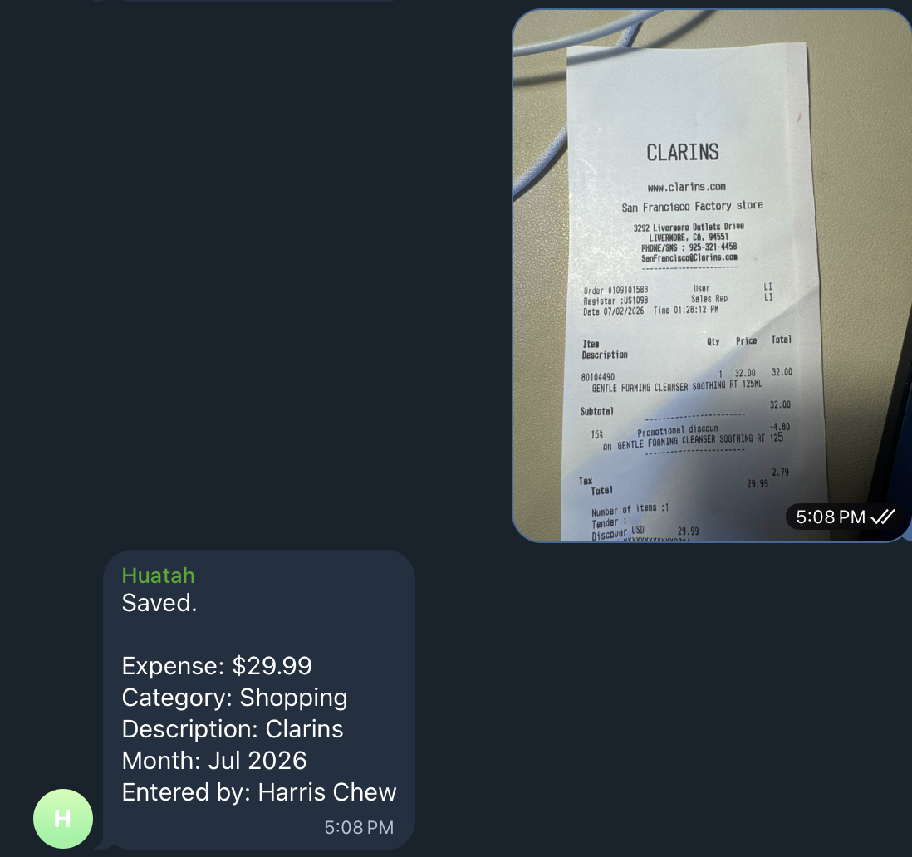
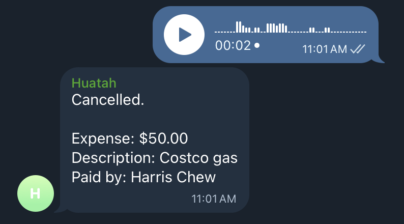

# Personal Bookkeeping Bot

> Stop being shocked at where all your money went. Get a quick, shared view of your spending — without the complexity of full accounting software.

## Why use this?

- **High-level spending visibility, not exact accounting.** No bank integrations, no penny-perfect matching — just a quick sense of where your money goes.
- **Record expenses in seconds, not minutes.** No complicated UI. Just send a message in your existing Telegram group: type an amount, snap a receipt photo, or send a voice message. It lands in Google Sheets automatically.
- **Built for shared spending.** Everyone in the group chat sees expenses in real time — shared visibility for couples, families, or housemates.
- **Analyse with AI.** Your data is in Google Sheets — ask ChatGPT, Claude, or any AI to spot patterns, build custom reports, or summarise your month.
- **Yours to extend.** The codebase is intentionally simple. Use it as a base and add whatever you need.

## Prerequisites

Before you start, you'll need:

- **Telegram account** — to create a bot via [@BotFather](https://t.me/BotFather)
- **Google account** — for Google Sheets and a Google Cloud service account
- **A hosting platform** — [Vercel](https://vercel.com) (recommended, free tier works) or any Node.js host (Railway, Render, Fly.io, VPS)
- **Node.js ≥ 20** _(optional)_ — only if deploying without Vercel (for `npm install` / `npm start`)
- **Google AI Studio account** _(optional)_ — enables receipt photo scanning and voice recording via Gemini

---

[](https://vercel.com/new/clone?repository-url=https%3A%2F%2Fgithub.com%2Fharrisrezal%2Fpersonal-bookkeeping-bot&env=TELEGRAM_BOT_TOKEN,TELEGRAM_WEBHOOK_SECRET,TELEGRAM_WEBHOOK_URL,GOOGLE_SHEET_ID,GOOGLE_SERVICE_ACCOUNT_EMAIL,GOOGLE_PRIVATE_KEY,SETUP_SECRET,ALLOWED_CHAT_ID,ALLOWED_USER_IDS&envDescription=See%20the%20README%20for%20where%20to%20find%20each%20value&envLink=https%3A%2F%2Fgithub.com%2Fharrisrezal%2Fpersonal-bookkeeping-bot%23setup)

## How to record an expense

**Option 1 — Tap `/expense` or `/refund` in the menu** and type the amount and description when prompted.

**Option 2 — Send a receipt photo** (requires `GEMINI_API_KEY`)
The bot reads the total and merchant from the photo automatically.

**Option 3 — Send a voice message** (requires `GEMINI_API_KEY`)
Say something like _"Spent 12.50 on groceries"_ — the bot transcribes and extracts the details.

All three flows end at the same category picker → confirm step before anything is saved.

### Receipt photo



### Voice message



## Other commands

```
/report_week          — spending report for this week
/report_current_month — spending report for this month
/report_month         — pick any month for a report
/categories           — list active categories
/help
```

---

## Setup

There are two external services to set up before deploying: a Telegram bot and a Google Sheet. Once those are ready, the rest is just filling in a form and running one command.

### Step 1 — Create a Telegram bot

1. Message [@BotFather](https://t.me/BotFather) on Telegram and send `/newbot`
2. Follow the prompts — you'll get a token like `7123456789:AAF...`
3. Add the bot to your Telegram group
4. In BotFather: `/setprivacy` → select your bot → **Disable** (required for receipt photos and voice messages)

### Step 2 — Create a Google Sheet and service account

1. Create a new blank [Google Sheet](https://sheets.google.com) — copy the ID from the URL (`/spreadsheets/d/THIS_PART/edit`)
2. In [Google Cloud Console](https://console.cloud.google.com), create a project, enable the **Google Sheets API**, and create a **service account**
3. On the service account → **Keys** → **Add Key** → **JSON** — download the file
4. From the JSON file, copy `client_email` and `private_key`
5. Share the Google Sheet with the `client_email` as **Editor**

### Step 3 — Deploy to Vercel

Click the **Deploy with Vercel** button above. Vercel will ask you to fill in env vars:

| Variable | Where to find it |
|---|---|
| `TELEGRAM_BOT_TOKEN` | From BotFather |
| `TELEGRAM_WEBHOOK_SECRET` | Any random string (e.g. `openssl rand -hex 20`) |
| `TELEGRAM_WEBHOOK_URL` | `https://YOUR-APP.vercel.app/api/telegram` — use your Vercel project URL once known |
| `GOOGLE_SHEET_ID` | From the Google Sheet URL |
| `GOOGLE_SERVICE_ACCOUNT_EMAIL` | `client_email` from the JSON key file |
| `GOOGLE_PRIVATE_KEY` | `private_key` from the JSON key file (paste as-is, `\n` characters are fine) |
| `SETUP_SECRET` | Any random string |
| `ALLOWED_CHAT_ID` | Leave blank for now |
| `ALLOWED_USER_IDS` | Leave blank for now |

> **Note:** After Vercel generates your project URL, update `TELEGRAM_WEBHOOK_URL` in Settings → Environment Variables and redeploy.

### Step 4 — Run setup

Call this once to create the sheet tabs, seed default categories, and register the Telegram webhook — all in one request:

```bash
curl -X POST \
  -H "x-setup-secret: YOUR_SETUP_SECRET" \
  https://your-app.vercel.app/api/setup
```

Expected response:
```json
{"ok":true,"webhook":"https://your-app.vercel.app/api/telegram"}
```

### Step 5 — Lock down access

Send any command (e.g. `/help`) in your Telegram group. Because `ALLOWED_CHAT_ID` is blank, the bot will reply with:

```
⚠️ Bot is open to everyone — set ALLOWED_CHAT_ID and ALLOWED_USER_IDS in your env vars to restrict access.

Chat ID: -1234567890
Your User ID: 987654321
```

Copy those values. In Vercel → Settings → Environment Variables, set:
- `ALLOWED_CHAT_ID` = the group chat ID (e.g. `-1234567890`)
- `ALLOWED_USER_IDS` = comma-separated user IDs for everyone who should have access (e.g. `987654321,112233445`)

Redeploy. The bot will now only respond to those users in that group.

---

## Deploying without Vercel

The bot runs on any Node.js host that provides a public HTTPS URL. Popular free options: [Railway](https://railway.app), [Render](https://render.com), [Fly.io](https://fly.io).

```bash
npm install
npm start        # starts Express server on $PORT (default 3000)
```

Most platforms (Railway, Render) detect the `start` script automatically — just connect your repo and set the env vars. Make sure `TELEGRAM_WEBHOOK_URL` points to your platform's HTTPS URL before calling `/api/setup`.

The `api/` handlers and Vercel serverless functions are the same code — `server.js` just wires them into Express. No other differences.

---

## Optional: AI features (receipt scanning + voice)

Set `GEMINI_API_KEY` (get one free at [Google AI Studio](https://aistudio.google.com/apikey)) to enable:
- Sending a receipt photo → bot reads the total and merchant
- Sending a voice message → bot transcribes and extracts the amount and description

| Variable | Default | Description |
|---|---|---|
| `GEMINI_API_KEY` | — | Enables AI features |
| `GEMINI_MODEL` | `gemini-2.0-flash` | Model to use |

---

## Optional: Localisation

| Variable | Default | Description |
|---|---|---|
| `TIMEZONE` | `UTC` | Timezone for reports and month labels, e.g. `Asia/Kuala_Lumpur`, `America/Los_Angeles` |
| `CURRENCY_SYMBOL` | `$` | Symbol shown in reports and summaries, e.g. `RM`, `£`, `€` |

---

## Categories

Categories live in the `Categories` tab of your Google Sheet. Edit them there at any time:

| Column | Description |
|---|---|
| `category` | Display name shown on buttons |
| `active` | `true` or `false` |
| `sort_order` | Lower numbers appear first |

Default categories: Groceries, Dining, Shopping, Transport, Bills, Health, Travel, Entertainment, Home, Personal Care, Gifts, Other.

---

## Swapping the AI provider

Receipt scanning and voice transcription are handled by `lib/ai.js`, which uses Gemini by default. To use a different provider (OpenAI, Anthropic, etc.), replace `lib/ai.js` with any implementation that exports:

```js
function createAiClient(env = process.env) {
  return {
    // imageBuffer: Buffer — return { merchant, total } or null
    extractReceiptData: async (imageBuffer) => { ... },
    // audioBuffer: Buffer, mimeType: string — return { type, amount, description } or null
    extractExpenseFromAudio: async (audioBuffer, mimeType) => { ... }
  };
}
module.exports = { createAiClient };
```

No other files need changing.

---

## Running tests

```bash
npm test
```

## Health check

```
https://your-app.vercel.app/api/health
```

Expected: `{"ok":true,"service":"shared-finance-bot"}`
